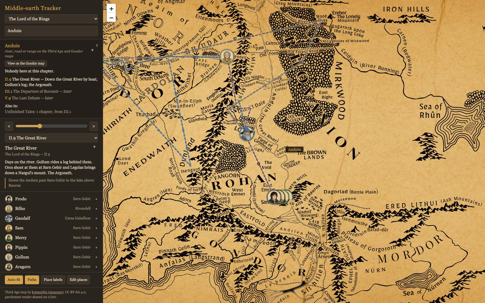

# Middle-earth Tracker

Chapter-by-chapter character positions for The Hobbit, The Lord of the Rings,
The Silmarillion and Unfinished Tales, drawn on six maps (Third Age
Middle-earth, the Shire, Gondor and Mordor, Beleriand, Numenor, Valinor).

Open `index.html` in a browser, or use the hosted copy at
https://wilsonwooten.github.io/middle-earth-tracker/. Pick a book, move the slider to the chapter
you are on. The view zooms to frame the current markers and routes with a margin
("Auto-fit" in the tools row turns that off). Markers show where each character is; dashed lines show the route
each has taken so far. Nothing past the current chapter is drawn.

Type in the search box (or press `/`) to find a character or place. A character result
shows where they are now, every chapter in this book where they move, and the other
books they appear in; picking a chapter jumps there and centers the map on them. A place
result lists who is there now and every chapter that sends someone there, and highlights
the place on the map: a pulsing ring for a point; for a river, range, forest, region or
sea the map's own ink inside the shape pulses white (an SVG colour-matrix filter over the
map image, masked to the shape, so it works from `file://`). On the Third Age map the mask
is the feature as drawn in the mapome vector source, so only that range or river lights up;
elsewhere it is the rough traced shape. When the place is on a different map from the
chapter's, the result offers "View on the ... map": the map switches but the chapter does not,
so whoever already stands at a place drawn on that map shows up and nothing later is revealed;
a banner over the map says which map you are on, and "back" or any chapter change returns to
the chapter's own map. "Follow" on a
character result hides everyone else so only that character and their route are drawn;
the slider still runs over every chapter, and they move only when the text moves them.

The character result and the chapter text each have a small triangle that collapses them,
and both scroll on their own, so the character list always keeps room. Click a name in the list to follow that character (click again to stop); the dot at the
right edge of a row hides or shows them on the map. Hover a marker or a name in the list for a character card: enlarged icon, what they
do in that chapter, and where they travelled from. The panel shows a chapter
summary and a movement note.

## Accuracy

The Hobbit and The Lord of the Rings positions have been checked chapter by chapter. The
Silmarillion and Unfinished Tales positions, the place events and the deaths table were
drafted from memory and have not all been verified against the text yet. If you spot a
character in the wrong place or a chapter note that is off, open an issue or a pull
request; corrections are welcome. Every position is one entry in a `data/*.js` file.

## Editing

See `CONTRIBUTING.md` for the data rules, the generated files and how to check a change.

- `data/shapes.js` -- highlight shapes for rivers, ranges, forests, regions and seas, as
  percent polylines (`line`) or polygons (`area`). Rough by design. In Edit mode a place
  result offers "Trace line" / "Trace area": click points on the map, double-click to
  finish, Esc to cancel; "Copy shapes JSON" exports the file.
- `data/shapes-svg.js` -- generated: per-feature mask paths for the Third Age map, pulled
  from the mapome SVG by `tools/extract-svg-masks.py` (clone the mapome repo, run the script
  from the repo root; `--verify` writes an overlay SVG to eyeball the selection). Which
  mapome layer each shape comes from is the `LAYER` table in the script; a shape not listed
  there keeps its rough trace. `tools/fit-svg-to-map.py` found the SVG-to-image fit.
- `data/places.js` -- place coordinates as percent of image width/height.
  Use the app's "Edit places" button to drag any pin, click the map to add
  one, then "Copy places JSON" and paste over the file.
- `data/summaries-*.js` -- per chapter `summary`, `moves`, and `who` (one line per
  character), keyed by book id and chapter number.
- `data/icon-colors.js` -- generated: ring and route colour per character, a softened standout
  colour from their icon (`tools/icon-colors.py`, needs Pillow and numpy). A coloured garment
  or feature wins; all-grey figures get slate, all-tan figures a dark umber so the ring reads
  on parchment. `OVERRIDES` in the script takes hand picks.
- `data/labels-gondor.js` -- map names for the Gondor map, which was rendered without text:
  wording, position and size per label, straight or along a path; "Map names" in the tools
  row toggles them. Kinds and default sizes are the `LABEL_KIND` table in `index.html`.
- `data/place-events.js` -- what happens at a place: `[book id, chapter, one line]` per entry,
  keyed by place or shape name. The place result merges these with the chapters that send
  someone there; lines for chapters past the one being read show as "later".
- `data/deaths.js` -- the chapter a character dies in, per book. From that chapter on the
  list and the character result say "died" with the chapter and place instead of "off the
  map". A character who merely leaves the story keeps the plain `""` retirement.
- `data/lineage.js` -- one race, kindred, house line per character, shown on the card.
- `data/extra-cast.js` -- second-tier cast (Valar, Maiar, supporting characters) and their
  notes, merged into the chapters at load.
- `data/*.js` -- who is where per chapter. A character keeps the last place
  given until a later chapter moves them; `""` takes them off the map.
  `pins` lists places to mark for an essay chapter with no moving characters.
  `map` on a chapter overrides the book's default map.

## Map credits and licenses

- Third Age: k1tesurfen, mapome (https://github.com/k1tesurfen/mapome), CC BY-SA 4.0;
  parchment render shared on r/lotr. The highlight masks in `data/shapes-svg.js` are path
  data taken from the same SVG, under the same license.
- Beleriand: Starcave / Hope Maps (https://www.deviantart.com/starcave), CC BY-SA 3.0,
  both the color and the "aged lore" variants.
- Numenor: generated with Gemini, redrawn from Shelly Shapiro's map in Unfinished Tales
  (1988). Layout after the original; the drawing is new.
- Gondor and Mordor: terrain generated with Gemini from Christopher Tolkien's map "A Part of
  Gondor, Rohan and Mordor" in The Return of the King, rendered without text; the names are
  drawn by the app (`data/labels-gondor.js`) in his wording and placement, set in IM Fell
  (SIL Open Font License, see `fonts/`).
- The Shire: generated with Gemini, redrawn from Christopher Tolkien's "A Part of the
  Shire" in The Fellowship of the Ring. Layout after the original; the drawing is new.
- Valinor: generated with Gemini from a text description based on Tolkien's
  Ambarkanta sketch. Original drawing.
- Character icons: generated with Gemini from text descriptions.

The two CC BY-SA maps keep their licenses; see `LICENSE`. The Gemini-made maps and
icons are used here for this project and carry no CC license.

## Character icons

See `icons/portrait-batches.txt`: paste a batch into Gemini, save the 3x2 grid, run
`./icons/slice.sh <batch> <image>`. Characters without an icon show a colored dot.
